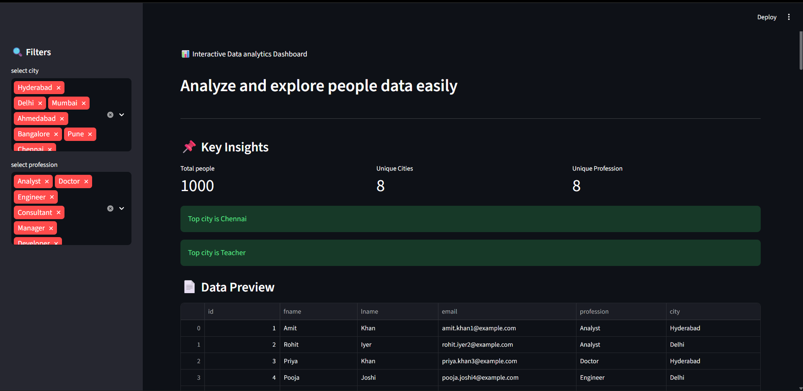
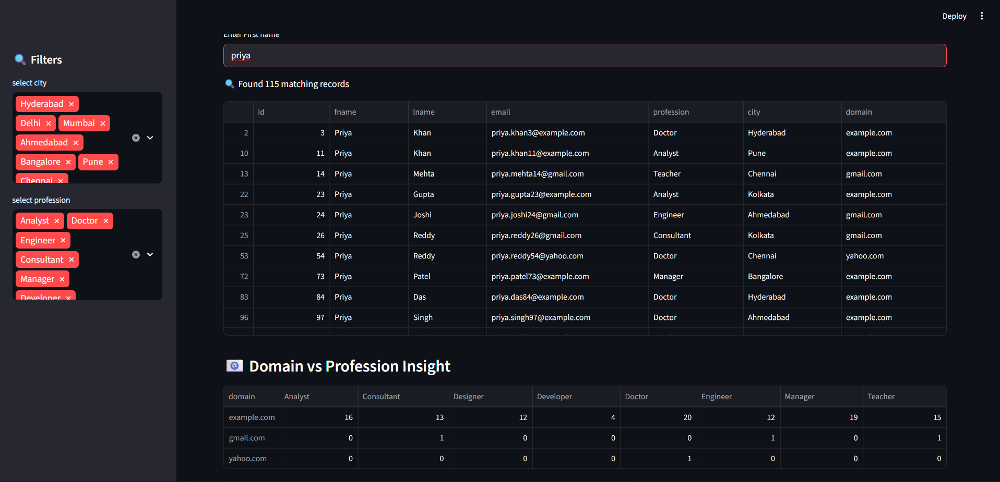

# 📊 Interactive Data Analytics Dashboard

A Streamlit-based interactive dashboard that allows users to explore, filter, and analyze people data using dynamic visualizations and real-time search.

---

## 🚀 Live App

👉 (Add your deployed link here later)

---

## 📸 Screenshots

### 📊 Dashboard

### 🔎 Search Feature

---

## 🧠 Key Features

✔ Filter data by City and Profession
✔ Real-time search by first name (case-insensitive)
✔ Key metrics (Total People, Unique Cities, Professions)
✔ City distribution visualization
✔ Profession distribution analysis
✔ Email domain analysis
✔ Domain vs Profession cross-tab insight
✔ Dynamic charts based on filters and search
✔ Handles empty filters and search gracefully

---

## ⚙️ Tech Stack

* Python
* Streamlit
* Pandas
* Matplotlib

---

## 💡 How It Works

* User selects:

  * City filter
  * Profession filter

* User can:

  * Search by first name

* System processes:

  * Filters dataset based on selection
  * Applies search condition dynamically

* Dashboard displays:

  * Key insights (counts, top values)
  * Visual charts (city & profession distribution)
  * Email domain usage
  * Domain vs profession relationship

---

## 📊 Data Analysis Implemented

* Data Cleaning (duplicate removal, string trimming)
* Categorical Data Filtering
* Frequency Distribution Analysis
* Cross-tabulation using Pandas (`crosstab`)
* Case-insensitive search handling
* Real-time interactive visualization

---

## 📂 Project Structure

app.py
1000_people_dataset.csv
requirements.txt
dashboard.png
Search by name .png

---

## 🎯 Learning Outcomes

* Built interactive dashboards using Streamlit
* Applied real-time filtering and search logic
* Performed data segmentation and analysis
* Implemented cross-variable insights
* Improved UI/UX for data applications

---

## 👨‍💻 Author

Amit Garje
